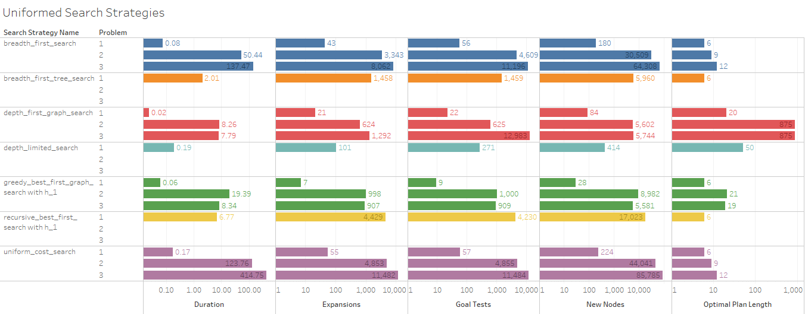

## planningAI

The third project in the [Artificial Intelligence Nanodegree program](https://classroom.udacity.com/nanodegrees/nd889/syllabus), centered around the implementation of uniformed and informed (heuristic) planning search.


### Results

[](https://public.tableau.com/views/planningAI/SummaryTable?:embed=y&:display_count=yes)

When `depth_limited_search` found a search, it was typically the quickest to find a solution, but it was almost always insane. The best metric for measuring search performance (in my opinion) is **Optimal Plan Length** which averages the solutions to demonstrate performance across all 3 problems. 

In general, the best search strategies found 9 nodes necessary; 6 for problem 1, 9 for problem 2, and 12 for problem 13. However some searches were more expensive than others, with `astar_search_with_hg_pg_levelsum` (Duration) and `astar_search with h1` using the most time complexity, and `breadth_first_search` with space complexity (New Nodes, Expansions).

#### Optimal Plan


| Problem 1                                                                                                       | Problem 2                                                                                                                                                              | Problem 3                                                                                                                                                                                                                      |
|-----------------------------------------------------------------------------------------------------------------|------------------------------------------------------------------------------------------------------------------------------------------------------------------------|--------------------------------------------------------------------------------------------------------------------------------------------------------------------------------------------------------------------------------|
| Load(C1,P1, SFO), Load(C2, P2, JFK), Fly(P1, SFO, JFK), Fly(P2, JFK, SFO), Unload(C1, P1, JFK), Unload(C2, P2, SFO) | Load(C3,P3, ATL), Fly(P3, ATL, SFO), Unload(C3, P3, SFO), Load(C2, P2, JFK), Fly(P2, JFK, SFO), Unload(C2, P2, SFO), Load(C1, P1, SFO), Fly(P1, SFO, JFK), Unload(C1, P1, JFK) | Load(C1,P1, SFO), Fly(P1, SFO, ATL), Load(C3, P1, ATL), Fly(P1, ATL, JFK), Unload(C3, P1, JFK), Unload(C1, P1, JFK), Load(C2, P1, JFK), Fly(P1, JFK, ORD), Load(C4, P1, ORD), Fly(P1, ORD, SFO), Unload(C4,P1, SFO), Unload(C2, P1, SFO) |

These were the shortest search paths found by any kind of search, informed or otherwise. In testing, informed searches which leverage heuristics took longer to run, but `astar_search with h_ignore_preconditions` discovered an reasonable optimal path extraordinarily quickly, albeit expensively, finding reasonable solutions better than most uninformed strategies. However, the uninformed strategies like `breadth_first_search`, `uniform_cost_search` also discovered the optimal solution, also relatively expensively in both cases. 

#### Uninformed Search Strategies

[](https://public.tableau.com/views/planningAI/UniformedSearchStrategies?:embed=y&:display_count=yes)

These strategies are uninformed, and rely only on the immediate frontier to make decisions. 

* `breadth_first_search`: Reliable, sane, and optimal. Expensive; both in terms of time and space complexity. Durations well above the average, and far too many new nodes and goal state checks. It is comforing to know there at exists a structure that could attempt to find a solution to a crazy tree if given enough computational power. 
* `depth_first_graph_search`: This typically yields some of the most hilarious up airpline itenaries I've ever seen, with an "optimal plan" of only 875 actions. At least it finds it quickly in small networks; in large networks it just seems to chase nonsense for infinity. 
*  `uniform_cost_search`: A variant of BFS but with a path cost to approximate with. Unfortunately in this case, it performs much worse than all the other search strategies, wasting time and resources. However, it still made it to the optimal solution, so at least there's that. 
* `greedy_best_first_graph_search`: I really wish there was a way I could wrap my head around this; I'm just not getting it as well as the others. Do you guys have any suggestions? 

#### Heuristic Search Strategies

[](https://public.tableau.com/views/planningAI/InformedSearchStrategies?:embed=y&:display_count=yes)


`astar_search with h_pg_levelsum` used the fewest the resources implying reduced algorithmic complexity. I was very impressed with its performance; but as the most well defined problem, this is not atypical. That said, all of the informed searches outranked the uninformed searches, always found the best solution, often with an increased cost in space (`astar_search_with_h1`) or time (`astar_search_with_h_ignore_preconditions`). 

#### Conclusion

| `h_1`        | `h_ignore_preconditions`           | `h_pg_levelsum`  |
| ------------- |-------------| -----|
| `# note that this is not a true heuristic` This heuristic is just a constant of 1 | This heuristic estimates the minimum number of actions that must be carried out from the current state in order to satisfy all of the goal conditions by ignoring the preconditions required for an action to be executed. |         This heuristic uses a planning graph representation of the problem state space to estimate the sum of all actions that must be carried out from the current state in order to satisfy each individual goal condition. |

[](https://public.tableau.com/views/planningAI/SummaryTable?:embed=y&:display_count=yes)

##### `astar_search with h_pg_levelsum` 
Relatively more space effecient than any other search strategy, despite taking a little longer to run. With the entire structure of the planning graph, it is the most well defined problem. 

##### `astar_search_with_h1`
Wasn't really an informed search since `h1` is arbitrary, so it ended up just being a more expensive BFS, since we took one step further than we needed to every time.  

##### `astar_search_with_h_ignore_preconditions` 
Yielded some significant savings as well, and reached an optimal solution faster without the whole planning graph. Definitely the all-star in my book; a good tradeoff between implementational scale and effeciency. 

### Problem


This project includes skeletons for the classes and functions needed to solve deterministic logistics planning problems for an Air Cargo transport system using a planning search agent. 

With progression search algorithms like those in the navigation problem from lecture, optimal plans for each 
problem will be computed.  

Unlike the navigation problem, there is no simple distance heuristic to aid the agent. 
Instead, you will implement domain-independent heuristics.

- Part 1 - Planning problems:
	- READ: applicable portions of the Russel/Norvig AIMA text
	- GIVEN: problems defined in classical PDDL (Planning Domain Definition Language)
	- DONE: Implement the Python methods and functions as marked in `my_air_cargo_problems.py`
	- DONE: Experiment and document metrics
- Part 2 - Domain-independent heuristics:
	- READ: applicable portions of the Russel/Norvig AIMA text
	- DONE: Implement relaxed problem heuristic in `my_air_cargo_problems.py`
	- DONE: Implement Planning Graph and automatic heuristic in `my_planning_graph.py`
	- DONE: Experiment and document metrics
- Part 3 - Written Analysis


#### Part 1 - Planning Problems

##### Ref: "Artificial Intelligence: A Modern Approach" 3rd edition chapter 10 *or* 2nd edition Chapter 11 on Planning, available [on the AIMA book site](http://aima.cs.berkeley.edu/2nd-ed/newchap11.pdf) sections: 

##### Progression Planning
**Progression planning problems** can be solved with graph searches such as **breadth-first, depth-first, and A***, where the **nodes of the graph are "states" and edges are "actions"**.  

A ** "state" is the logical conjunction of all boolean ground "fluents", or state variables, that are possible for the problem using Propositional Logic.** 

For example, we might have a problem to plan the transport of one cargo (`C1`), on a
single available plane, `P1`, from one airport to another, `SFO` to `JFK`:


Fluent | `At(p, a)` | `At(c,a)` | `Plane(p)` | `Cargo(c)` | `Airport(a)`| 
--|---------|----------|---------|----|--
Description |Plane `p` is at at `a` | Cargo `c` is at at `a` | Plane `p` | Cargo `c` | Airport `a` |
 Example | `At(P2, JFK)` |  `At(C1, JFK)` |  `P1` | `C1` |  `JFK`
 Boolean | `T`/`F` |  `T`/`F` |  `T`/`F` | `T`/`F` |  `T`/`F`

Even in this simple example, there are five fluents, or state variables, which means our state space could be as large as 2<sup>5</sup>. 


Also note the following:
>- While the initial state defines every fluent explicitly, in this case mapped to **TTFFF**, the goal may be a set of states.  Any state that is `True` for the fluent `At(C1,JFK)` meets the goal.
>- Even though PDDL uses variable to describe actions as "action schema", *these problems are not solved with First Order Logic.  They are solved with Propositional logic and must therefore be defined with concrete (non-variable) actions and literal (non-variable) fluents in state descriptions.*
>- The fluents here are mapped to a simple string representing the boolean value of each fluent in the system, e.g. **TTFFTT...TTF**.  This will be the state representation in the `AirCargoProblem` class and is compatible with the `Node` and `Problem` classes, and the search methods in the AIMA library (like DFS, BFS, UFS, ...).  

All problems are in this Air Cargo domain.  They have the same action schema defined, but different initial states and goals.

**- Air Cargo Action Schema:**
```
Action(Load(c, p, a),
	PRECOND: At(c, a) ∧ At(p, a) ∧ Cargo(c) ∧ Plane(p) ∧ Airport(a)
	EFFECT: ¬ At(c, a) ∧ In(c, p))
Action(Unload(c, p, a),
	PRECOND: In(c, p) ∧ At(p, a) ∧ Cargo(c) ∧ Plane(p) ∧ Airport(a)
	EFFECT: At(c, a) ∧ ¬ In(c, p))
Action(Fly(p, from, to),
	PRECOND: At(p, from) ∧ Plane(p) ∧ Airport(from) ∧ Airport(to)
	EFFECT: ¬ At(p, from) ∧ At(p, to))
```

- **Problem 1 initial state and goal:**
```
Init(At(C1, SFO) ∧ At(C2, JFK) 
	∧ At(P1, SFO) ∧ At(P2, JFK) 
	∧ Cargo(C1) ∧ Cargo(C2) 
	∧ Plane(P1) ∧ Plane(P2)
	∧ Airport(JFK) ∧ Airport(SFO))
Goal(At(C1, JFK) ∧ At(C2, SFO))
```

- **Problem 2 initial state and goal:**
```
Init(At(C1, SFO) ∧ At(C2, JFK) ∧ At(C3, ATL) 
	∧ At(P1, SFO) ∧ At(P2, JFK) ∧ At(P3, ATL) 
	∧ Cargo(C1) ∧ Cargo(C2) ∧ Cargo(C3)
	∧ Plane(P1) ∧ Plane(P2) ∧ Plane(P3)
	∧ Airport(JFK) ∧ Airport(SFO) ∧ Airport(ATL))
Goal(At(C1, JFK) ∧ At(C2, SFO) ∧ At(C3, SFO))
```
- **Problem 3 initial state and goal:**
```
Init(At(C1, SFO) ∧ At(C2, JFK) ∧ At(C3, ATL) ∧ At(C4, ORD) 
	∧ At(P1, SFO) ∧ At(P2, JFK) 
	∧ Cargo(C1) ∧ Cargo(C2) ∧ Cargo(C3) ∧ Cargo(C4)
	∧ Plane(P1) ∧ Plane(P2)
	∧ Airport(JFK) ∧ Airport(SFO) ∧ Airport(ATL) ∧ Airport(ORD))
Goal(At(C1, JFK) ∧ At(C3, JFK) ∧ At(C2, SFO) ∧ At(C4, SFO))
```

##### GIVEN: 
- Classical PDDL problems

##### DONE: Implement methods and functions in `my_air_cargo_problems.py`
- `AirCargoProblem.get_actions` method including `load_actions` and `unload_actions` sub-functions
- `AirCargoProblem.actions` method
- `AirCargoProblem.result` method
- `air_cargo_p2` function
- `air_cargo_p3` function

#### Part 2 - Domain-independent heuristics

##### Ref: "Artificial Intelligence: A Modern Approach" 3rd edition chapter 10 *or* 2nd edition Chapter 11 on Planning, available [on the AIMA book site](http://aima.cs.berkeley.edu/2nd-ed/newchap11.pdf) section: 

##### Planning Graph
The planning graph is somewhat complex, but is useful in planning because it is a polynomial-size approximation of the exponential tree that represents all possible paths. 

The planning graph can be used to provide automated admissible heuristics for any domain.  It can also be used as the first step in implementing GRAPHPLAN, a direct planning algorithm that you may wish to learn more about on your own (but we will not address it here).
>

##### DONE: Implement heuristic method in `my_air_cargo_problems.py`
- `AirCargoProblem.h_ignore_preconditions` method

##### DONE: Implement a Planning Graph with automatic heuristics in `my_planning_graph.py`
- `PlanningGraph.add_action_level` method
- `PlanningGraph.add_literal_level` method
- `PlanningGraph.inconsistent_effects_mutex` method
- `PlanningGraph.interference_mutex` method
- `PlanningGraph.competing_needs_mutex` method
- `PlanningGraph.negation_mutex` method
- `PlanningGraph.inconsistent_support_mutex` method
- `PlanningGraph.h_levelsum` method

### Setup

#### Environment
- Python 3.4 or higher (via Anaconda preferably)
- Starter code includes a copy of [companion code](https://github.com/aimacode) for the Stuart Russel/Norvig AIMA text.  

### Testing
- The planning problem for the "Have Cake and Eat it Too" problem in the book has been implemented in the `example_have_cake` module as an example.
- The `tests` directory includes `unittest` test cases to evaluate your implementations. All tests should pass before you submit your project for review. From the AIND-Planning directory command line:
    - `python -m unittest tests.test_my_air_cargo_problems`
    - `python -m unittest tests.test_my_planning_graph`
- The `run_search` script is provided for gathering metrics for various search methods on any or all of the problems and should be used for this purpose.