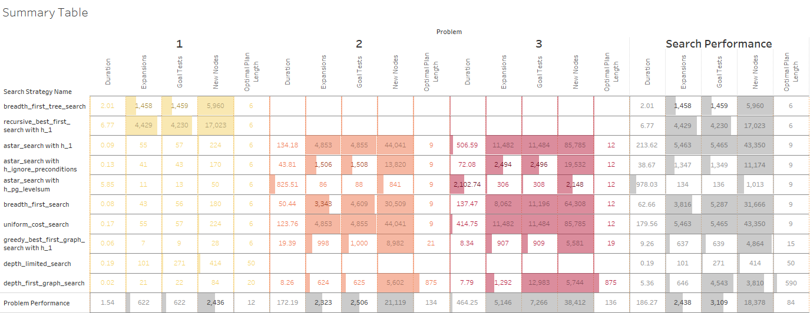

# Heuristic Analysis
## Planning Search

## Results

When `depth_limited_search` found a search, it was typically an 

## Optimal Plan

| Problem 1                                                                                                       | Problem 2                                                                                                                                                              | Problem 3                                                                                                                                                                                                                      |
|-----------------------------------------------------------------------------------------------------------------|------------------------------------------------------------------------------------------------------------------------------------------------------------------------|--------------------------------------------------------------------------------------------------------------------------------------------------------------------------------------------------------------------------------|
| Load(C1,P1, SFO), Load(C2, P2, JFK), Fly(P1, SFO, JFK), Fly(P2, JFK, SFO), Unload(C1, P1, JFK), Unload(C2, P2, SFO) | Load(C3,P3, ATL), Fly(P3, ATL, SFO), Unload(C3, P3, SFO), Load(C2, P2, JFK), Fly(P2, JFK, SFO), Unload(C2, P2, SFO), Load(C1, P1, SFO), Fly(P1, SFO, JFK), Unload(C1, P1, JFK) | Load(C1,P1, SFO), Fly(P1, SFO, ATL), Load(C3, P1, ATL), Fly(P1, ATL, JFK), Unload(C3, P1, JFK), Unload(C1, P1, JFK), Load(C2, P1, JFK), Fly(P1, JFK, ORD), Load(C4, P1, ORD), Fly(P1, ORD, SFO), Unload(C4,P1, SFO), Unload(C2, P1, SFO) |

These were the shortest search paths found by any kind of search, informed or otherwise. In testing, informed searches which leverage heuristics took longer to run, but `astar_search with h_ignore_preconditions` discovered an reasonable optimal path extraordinarily quickly, albeit expensively, finding reasonable solutions better than most uninformed strategies. However, the uninformed strategies like `breadth_first_search`, `uniform_cost_search` also discovered the optimal solution, also relatively expensively in both cases.  

### Uninformed Search Strategies

These strategies are uninformed, and rely only on the immediate frontier to make decisions. 

* `breadth_first_search`: Reliable, sane, and optimal. Expensive; both in terms of time and space complexity. Durations well above the average, and far too many new nodes and goal state checks. It is comforing to know there at exists a structure that could attempt to find a solution to a crazy tree if given enough computational power. 
* `depth_first_graph_search`: This typically yields some of the most hilarious up airpline itenaries I've ever seen, with an "optimal plan" of only 875 actions. At least it finds it quickly in small networks; in large networks it just seems to chase nonsense for infinity. 
*  `greedy_best_first_graph_search with h1`: (TODO: Find out exactly what `greedy best first graph search with h1` is. 

### Heuristic Search Strategies

Compare and contrast heuristic search result metrics using A* with the and "level-sum" heuristics for Problems 1, 2, and 3.

I'll be honest; I'm not 100% sure if these metrics are supposed to go up our down. That said, `astar_search with h_ignore_preconditions` used the fewest the resources and ran the fastest, implying reduced algorithmic complexity.  TODO: Find out why. 

### Conclusion
TODO: What was the best heuristic used in these problems? Was it better than non-heuristic search planning methods for all problems? Why or why not?

